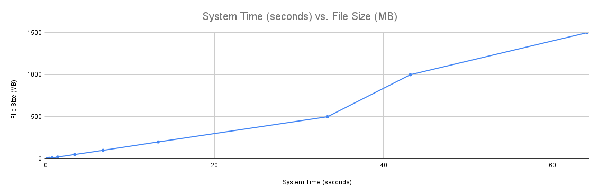

# I gave the answer.txt for the link to this and the README.md is the answers. I couldn't figure a way to do an image in .txt but I could with markdown. Sorry

## 1. Chart Depiction System Time with File Size increase.

## 2. Bottleneck Reasoning
This chart is based off of system time results after successfully transferring files from 1 megabyte to 1500 megabytes (1.5 GB). Visually, this chart demonstrates that as file size increases, the transfer time grows more then linearly. I believe that the main bottleneck lies between the client and the FIFO request channels. Since each file is split into multiple chunks, and every chunk requires a request/response cycle, the larger file sizes involve repeated message passing. This cycle calls for context switching and kernel-level I/O handling, so for smaller files this overhead doesn't have much of an effect, but it takes over in the larger file transfers. The large jump in time with the increasingly larger files indicates that the pipe-based synchronization, rather than faw file size only, is the limiting factor causing the bottleneck.

